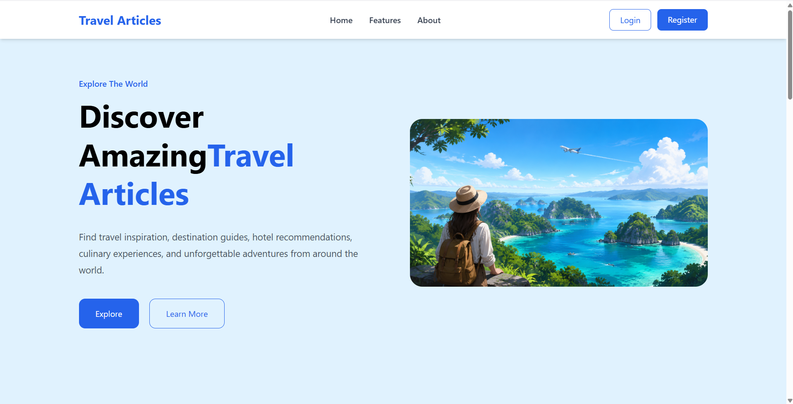
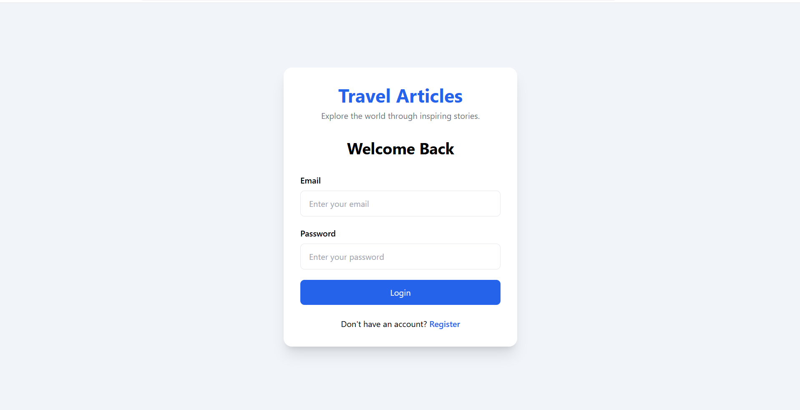
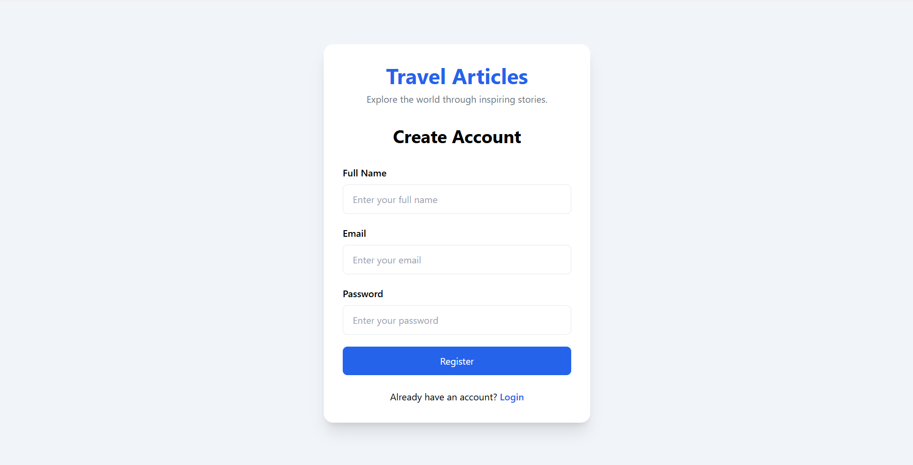
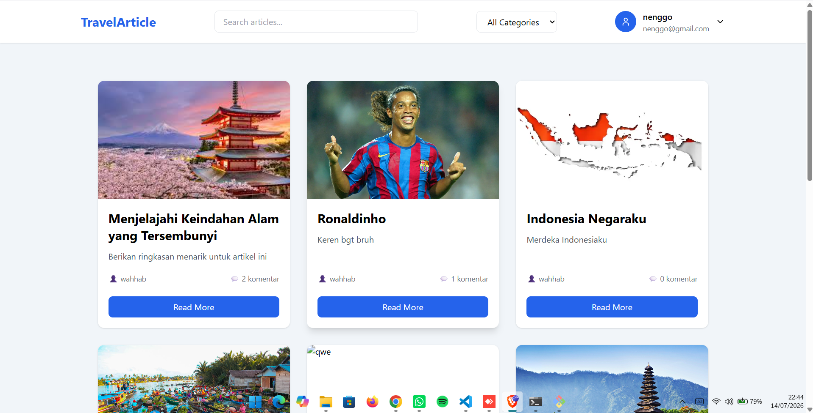
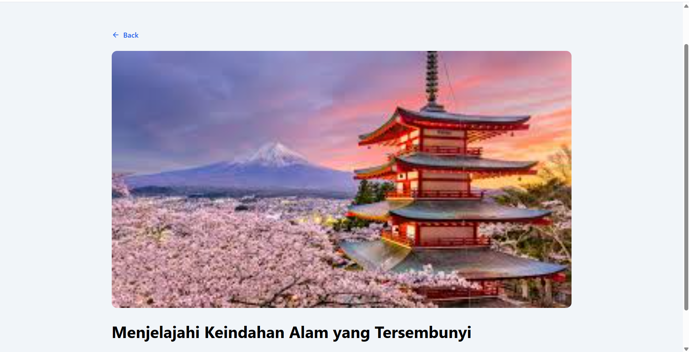

# 🌍 Travel Article App

Travel Article App adalah aplikasi web yang memungkinkan pengguna membaca artikel wisata dari berbagai daerah. Aplikasi ini dibangun menggunakan React, TypeScript, Tailwind CSS, dan Strapi sebagai backend CMS.

## ✨ Features

- 🔐 Authentication (Login & Register)
- 🛡️ Protected Route
- 📖 View Travel Articles
- 🔍 Search Articles
- 📄 Article Detail Page
- 📑 Pagination
- 👤 User Profile
- ⚡ Debounced Search
- 💀 Skeleton Loading
- 📱 Responsive UI

---

## 🛠️ Tech Stack

### Frontend
- React
- TypeScript
- Vite
- Tailwind CSS
- React Router DOM
- Axios
- React Hook Form
- Zod
- React Hot Toast
- Lucide React

### Backend
- Strapi CMS
- JWT Authentication
- REST API

---

## 📂 Project Structure

```
src
├── api
├── components
├── context
├── hooks
├── layouts
├── pages
├── schemas
├── services
├── types
├── App.tsx
└── main.tsx
```

---

## 🚀 Installation

Clone repository

```bash
git clone https://github.com/Axezy/travel-article-app.git
```

Masuk ke folder project

```bash
cd travel-article-app
```

Install dependencies

```bash
npm install
```

Jalankan project

```bash
npm run dev
```

---

## 🔧 Environment Variables

Buat file `.env`

```env
VITE_API_URL=https://your-api-url/api
```

---

## 📸 Screenshots

### Landing Page



---

### Login



---

### Register



---

### Dashboard



---

### Detail Article



Contoh:

- Landing Page
- Dashboard
- Detail Article
- Login
- Register

---

## 📌 Future Improvements

- Filter berdasarkan kategori
- Bookmark artikel
- Komentar artikel
- Edit profile
- Dark Mode

---

## 👨‍💻 Author

**Garnenggo**

GitHub:
https://github.com/Axezy